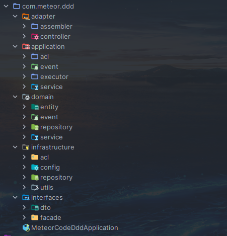

## DDD分层架构

- 用户接口层
  
    主要完成后端微服务与前端不同用户的接口和数据适配。

- 应用层

    协调领域层多个聚合的领域服务、和其他微服务的应用服务完成服务的组合和编排。

- 领域层
    
    领域模型核心，主要实现领域模型的核心业务逻辑，体现领域模型的业务能力。

- 基础设施层
  
    贯穿DDD所有层，为其他各层提供通用的技术和基础服务，包含第三方工具、驱动、消息中间件、网关、文件、缓存以及数据库等。

<b>三层架构与DDD四层架构的比较和关系</b>

## 代码模型

- **interfaces** (用户接口层)
  > 与适配层同属一层，但是为了其它微服务使用，提高代码复用效率，可单独抽成一个api模块使用；为适配层和应用层提供数据服务
  - **dto**：前端运用数据载体，不实现任何业务逻辑。
  - **facade**：封装应用服务，提供较粗粒度的调用接口。

- **adapter** (适配层)
  
  - **assembler**：实现DTO和DO领域对象之间的相互转换和数据转换。
  - **controller**：控制层，实现对web、api接口的实现
  
- **application** (应用层)

  - **acl**：防腐接口层，接入其它微服务接口，实现在基础设施层

  - **event**：事件
    - **publish**： 事件发布。
    - **subscribe**：事件订阅，事件处理相关的核心业务逻辑实现放在领域层。
    
> 应用层和领域层度可以进行事件发布。为了实现事件订阅的统一管理，建议将微服务内所有事件订阅相关代码都统一放到应用层，事件处理相关的核心业务逻辑实现放在领域层。
  - **service**：应用服务，对多个领域服务或其他微服务的应用服务进行封装、编排和组合。
  - **executor**：命令执行器，采用命令处理方式处理前端请求。

- **domain** (领域层)
  
  - **entity**：实体，存放聚合根、实体、和值对象。
  - **event**：事件，存放事件实体以及与事件活动相关的业务逻辑代码。
  - **service**：领域服务，存放领域服务、工厂服务的相关代码。
  - **repository**：仓储，存放仓储服务相关的接口，实现放在基础设施层。
  
- **infrastructure** (基础层)
  - **config**：存放配置相关的代码
  - **acl**：防腐实现层，接入其他微服务代码
  - **util**：存放平台、开发框架、消息、数据库、缓存、文件、总线、网关、第三方类库和通用算法的基础代码。
  - **repository**: 仓储层
    - **impl**: 领域层仓储实现
    - **po**：持久化对象
    - **convert**：PO转DO工具 

## 分层协作 

<b>微服务的服务调用关系</b>

<b>微服务的服务封装和组合方式</b>

## 代码详解
<https://github.com/dream-colors/meteor-code-ddd/tree/master/src/main/java/com/meteor/ddd>
